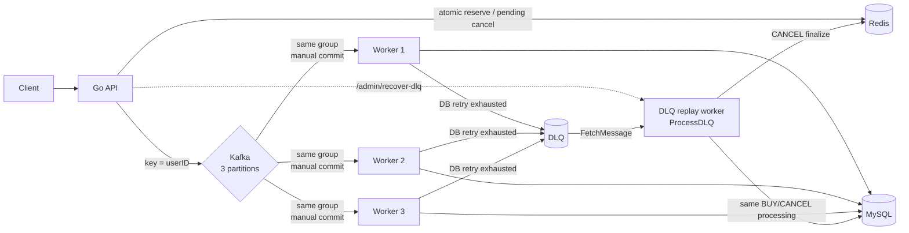

# Ticket System v8

Redis, Kafka, MySQL을 이용해 티켓 구매와 취소를 비동기로 처리하는 Go 프로젝트입니다. 목표는 높은 수치를 주장하는 것이 아니라 동시 요청과 장애 상황에서 **무엇을 보장하고 무엇을 아직 보장하지 못하는지**를 코드와 재현 가능한 검증으로 설명하는 것입니다.

## Development journey

이 저장소의 v7까지는 티켓 예매 도메인에 Redis 동시성 제어, Kafka 비동기 처리, MySQL 영속화와 DLQ 기반 실패 메시지 격리를 구현했습니다. 그러나 DLQ 전송만으로 장애 처리가 끝나는지, MySQL commit과 Kafka offset commit 사이에서 worker가 죽으면 어떤 상태가 남는지, Retry와 Replay가 복구 중인 시스템에 어떤 부하를 만드는지는 충분히 검증하지 못했습니다.

이 질문은 별도 프로젝트인 [kafka-recovery-lab](https://github.com/whxodus0121/kafka-recovery-lab)에서 at-least-once delivery, manual commit, `eventId` 기반 idempotent consumer, Retry/DLQ/Replay, Backoff/Jitter, Retry Storm과 Recovery rate control을 단계별로 재현하며 다뤘습니다.

그 결과를 다시 [ticket-system](https://github.com/whxodus0121/ticket-system) v8에 적용할 때는 Lab 전체를 복사하지 않고 실제 예매 시스템에 필요한 경계만 선택했습니다.

```text
ticket-system v1~v7
  Redis/Kafka/MySQL 기반 예매와 DLQ 격리
        ↓ 남은 장애 경계 질문
kafka-recovery-lab
  재전달, idempotency, Retry/DLQ/Replay와 복구 부하 실험
        ↓ 도메인에 필요한 결과만 선택
ticket-system v8
  atomic reservation/cancel, user ordering, manual commit,
  destination-success/source-commit 경계, crash redelivery 검증
```

### Version history

| Version | Focus |
|---|---|
| v1.0 | Docker 기반 Redis/MySQL 연결과 기본 구매 흐름 |
| v2.0 | Redis lock과 DB connection pool을 이용한 초과 판매 방어 |
| v3.0 | 동일 사용자의 중복 구매 방지 |
| v4.0 | 구매 취소 흐름과 동기 MySQL write 병목 확인 |
| v4.5 | Kafka 비동기 MySQL 저장과 DB UNIQUE 기반 중복 방어 |
| v5.0 | Redis Lua 재고 연산, 비동기 취소와 DLQ 격리 |
| v6.0 | 기본 Prometheus/Grafana 관측과 부하 실험 |
| v7.0 | Redis Sorted Set 기반 virtual waiting queue |
| v8.0 | Redis 상태 전이 원자화, 사용자 단위 Kafka 순서, manual commit과 장애 경계 검증 |

### 두 프로젝트의 책임 경계

| Recovery Lab 개념 | ticket-system v8 반영 | 설명 |
|---|---|---|
| At-least-once delivery | 적용 | commit 응답 유실과 worker 재시작 시 재전달을 허용하고 부수효과를 멱등하게 처리합니다. |
| `FetchMessage` + manual commit | 적용 | DB 성공 또는 DLQ 발행 성공 뒤에만 source offset을 commit합니다. |
| Destination publish 후 source commit | 적용 | DLQ 발행 실패 시 source offset을 남깁니다. |
| Worker crash / redelivery 검증 | 적용 | 실제 Kafka·MySQL에서 DB 반영 뒤 commit 실패를 주입하고 같은 record를 재처리합니다. |
| `eventId` + `processed_events` | 미적용 | 현재 BUY/CANCEL 효과는 UNIQUE INSERT, idempotent DELETE/Lua로 동일 record 재처리에 안전해 추가 테이블의 비용을 선택하지 않았습니다. |
| Retryable / Non-Retryable 분류 | Lab 전용 | v8의 단순한 동일 프로세스 재시도와 달리 오류 분류 정책 실험은 Lab에 남깁니다. |
| Retry Topic / Retry Worker | Lab 전용 | ticket-system에는 새 topic과 worker를 추가하지 않았습니다. |
| Fixed / Exponential / Full Jitter | Lab 전용 | 전략별 Retry Storm 비교는 Lab의 실험 범위입니다. |
| Selective/Bulk DLQ Replay | Lab 전용 | v8은 관리 endpoint의 단순 수동 replay만 제공합니다. |
| Recovery Topic / rate limiting | Lab 전용 | 복구 발행률·처리율 제한은 Lab의 차별화된 범위입니다. |
| Recovery 전용 Prometheus/Grafana 실험 | Lab 전용 | v8은 기존의 기본 앱 지표만 유지하며 Lab의 복구 지표와 대시보드를 이식하지 않았습니다. |
| Redis concurrency / user partition ordering | ticket-system 전용 | 실제 예매 도메인의 재고 경쟁과 BUY/CANCEL 순서를 다룹니다. |

## Architecture



- API: Redis 상태 변경과 Kafka 이벤트 발행
- Redis: 재고, 구매자, 취소 pending 상태
- Kafka: `ticket-topic`과 `ticket-dlq-topic`, 각각 3 partitions
- Worker: 동일 consumer group의 3개 consumer가 MySQL 처리를 병렬 수행
- MySQL: 최종 구매 내역과 `(user_id, ticket_name)` UNIQUE constraint

## v8 reliability story

### 1. Concurrent purchase

- **문제:** 중복 확인, 재고 확인, 감소와 구매자 등록을 별도 Redis 명령으로 실행하면 같은 사용자의 동시 요청이 모두 통과할 수 있습니다.
- **재현:** 같은 사용자의 구매 요청 20개와 재고 10개에 대한 서로 다른 사용자 요청 50개를 동시에 보냅니다.
- **원인:** 여러 Redis 명령 사이에 다른 요청이 끼어드는 check-then-act race입니다.
- **해결:** 하나의 Lua script가 `SISMEMBER → stock 확인 → DECR + SADD`를 원자적으로 수행합니다. Kafka 발행 실패 보상도 한 번만 재고를 복구하는 Lua script로 처리합니다.
- **검증:** 동일 사용자는 1건만 성공하고, 재고 10개는 정확히 10건만 성공하며 stock이 음수가 되지 않았습니다.
- **남은 한계:** Redis 예약 성공 직후 Kafka 발행 전에 프로세스가 종료되는 경계는 원자적이지 않습니다.

### 2. Kafka ordering

- **문제:** 같은 사용자의 BUY와 CANCEL이 다른 partition으로 가면 여러 worker에서 CANCEL이 먼저 처리될 수 있습니다.
- **재현:** 3 partitions와 여러 worker 상태에서 동일 사용자의 BUY 직후 CANCEL을 반복합니다.
- **원인:** key를 고려하지 않는 partition 선택은 사용자 단위 순서를 보장하지 않습니다.
- **해결:** 모든 구매·취소 record의 key를 `userID`로 지정하고 `kafka.Hash` partitioner를 사용합니다.
- **검증:** 동일 user의 BUY/CANCEL은 같은 partition으로 계산되며, 20개 동시 사용자 흐름의 최종 MySQL 구매 행과 Redis 구매/pending 상태가 모두 0으로 수렴했습니다.
- **남은 한계:** 특정 key에 트래픽이 집중되면 hot partition이 될 수 있고, DLQ replay와 source의 최신 이벤트 사이 순서는 별도 문제입니다.

### 3. Message loss and DLQ boundary

- **문제:** 비즈니스 처리 전에 offset이 진행되거나 DLQ 발행 실패에도 source를 commit하면 record를 잃습니다.
- **재현:** MySQL 중단과 도달할 수 없는 DLQ broker를 각각 주입합니다.
- **원인:** source consume, MySQL transaction, destination publish와 offset commit은 하나의 원자적 transaction이 아닙니다.
- **해결:** `FetchMessage`로 읽고 MySQL 성공 또는 DLQ 발행 성공 뒤에만 `CommitMessages`를 호출합니다. DB와 DLQ가 모두 실패하면 commit하지 않고 worker를 중단합니다.
- **검증:** DB 실패는 source 좌표 header를 가진 DLQ record로 이동한 뒤 source lag 0이 되었고, DLQ 발행 실패는 새 consumer에서 같은 source record가 다시 전달됐습니다.
- **남은 한계:** DLQ 발행 성공 후 source commit 응답이 유실되면 destination duplicate가 생길 수 있습니다. 이 프로젝트는 exactly-once를 주장하지 않습니다.

### 4. Duplicate delivery

- **문제:** `MySQL COMMIT → worker failure → offset 미commit`이면 동일 Kafka record가 재전달됩니다.
- **재현:** 실제 Kafka record를 처리해 MySQL 반영을 완료한 직후 `CommitMessages`만 결정적으로 실패시키고 같은 group의 worker를 다시 시작합니다.
- **원인:** Kafka offset과 외부 MySQL commit은 원자적으로 묶을 수 없습니다.
- **해결:** BUY는 `(user_id, ticket_name)` UNIQUE constraint와 GORM의 `clause.OnConflict{DoNothing: true}`를 사용해 중복 INSERT를 no-op으로 처리합니다. CANCEL은 0-row DELETE를 성공으로 취급합니다. 취소의 Redis finalize는 pending member를 제거한 첫 호출에서만 구매자 제거와 재고 증가를 수행합니다.
- **검증:** BUY는 첫 처리와 재전달 뒤 모두 MySQL row 1개, CANCEL은 두 번 처리해도 MySQL row 0개와 Redis stock 1회 증가만 남고, 재처리 뒤 source offset이 진행됩니다.
- **남은 한계:** 이것은 현재 BUY/CANCEL 효과와 동일 record의 재전달에 대한 멱등성입니다. 결제·감사 로그 같은 새 비멱등 효과가 추가되거나 같은 `eventId`의 payload 충돌을 탐지해야 한다면 Lab의 transactional `processed_events` 방식이 필요합니다.

### 5. Load test interpretation

- **문제:** 50,000 사용자를 실행했다는 사실을 `50,000 TPS`로 표현하면 사용자 흐름, HTTP 요청 수와 처리율을 혼동합니다.
- **재현:** 로컬 Docker에서 사용자 흐름 50,000개, 동시성 300, 초기 재고 1,000으로 실행합니다.
- **원인:** 대기 polling으로 한 사용자 흐름이 여러 HTTP 요청을 만들며, 누적 사용자 수는 초당 처리량이 아닙니다.
- **해결:** 각 HTTP 요청 직전부터 응답까지 latency를 측정하고 실제 attempt 수와 총 duration으로 req/s를 계산합니다.
- **검증:** 51,540 attempts, 12.745초, 4,044.06 req/s, transport error 0이며 Redis 구매자·MySQL 행은 각각 1,000, source lag는 0이었습니다.
- **남은 한계:** p99 999.260ms의 원인은 이번 측정으로 입증하지 못했으며 tail latency 추가 분석 대상입니다. 로컬 1회 결과를 운영 성능으로 일반화하지 않습니다.

## Consumer idempotency decision

현재 failure window는 다음과 같습니다.

```text
Kafka FetchMessage
→ MySQL business operation commit
→ offset commit 실패 또는 worker crash
→ 같은 topic/partition/offset 재전달
```

현재 도메인에서는 별도 `processed_events`를 추가하지 않았습니다.

| Event | 첫 처리 | 동일 record 재처리 | 남는 효과 |
|---|---|---|---|
| BUY | purchase INSERT | UNIQUE 충돌 시 GORM의 `clause.OnConflict{DoNothing: true}`가 중복 INSERT를 no-op으로 처리 | purchase row 1개 |
| CANCEL | 조건 DELETE + Redis finalize | 0-row DELETE 성공, pending 부재 시 Lua no-op | row 0개, stock 1회 증가 |

`processed_events`는 marker INSERT, transaction, 인덱스 보존과 duplicate 조회 비용을 추가합니다. 현재처럼 비즈니스 상태 자체가 동일 record를 충분히 식별하고 연산이 멱등한 경우에는 이 비용이 실질적 안전성을 늘리지 않습니다. 반대로 side effect가 누적형 UPDATE이거나 이벤트 identity와 payload 충돌 검사가 필요해지면 `eventId` 등록과 business update를 같은 MySQL transaction에 두어야 합니다. Redis나 메모리의 별도 marker는 MySQL commit과 다시 분리되므로 대안이 아닙니다.

## Verification

### Automated and integration tests

```powershell
go test ./...
go vet ./...

$env:REDIS_INTEGRATION_ADDR = "127.0.0.1:16379"
$env:KAFKA_INTEGRATION_BROKER = "127.0.0.1:9092"
$env:MYSQL_INTEGRATION_DSN = "root:password123@tcp(127.0.0.1:3306)/ticket_db?charset=utf8mb4&parseTime=True&loc=Local"
go test ./repository ./worker -count=1 -v
```

환경 변수가 없으면 외부 인프라가 필요한 integration test만 skip됩니다. 단위 테스트는 DB/DLQ 성공 여부와 source commit 경계를 확인하고, integration test는 실제 Redis/Kafka/MySQL에서 다음을 확인합니다.

- Redis 중복 구매와 sold-out 원자성
- DB 실패 + DLQ 실패 시 source record 재전달
- DB commit 뒤 offset commit 실패 시 동일 BUY/CANCEL record 재전달과 단일 side effect
- 재처리 성공 뒤 source offset 진행

### Docker Compose E2E result

2026-09-15 로컬 Docker Compose E2E 결과와 2026-09-16 추가 장애 경계 integration 결과입니다.

| Scenario | Observed result | Result |
|---|---|---|
| Normal purchase | HTTP 200, Redis stock `5→4`, purchaser 1, MySQL row 1 | PASS |
| Duplicate purchase | 동일 user 20개 동시 요청: 200 1건, 400 19건, stock 1 감소, MySQL row 1 | PASS |
| Sold out | stock 10, 50개 동시 요청: 200 10건, 410 40건, Redis stock 0, MySQL rows 10 | PASS |
| Normal cancel | MySQL row 삭제, stock 1 증가, purchased/pending 제거 | PASS |
| Duplicate cancel | HTTP 400, stock 추가 증가 없음 | PASS |
| DB failure | MySQL 중지 후 3회 실패, source metadata를 포함한 DLQ 메시지 생성, source lag 0 | PASS |
| DLQ recovery | MySQL 복구 후 DLQ replay, MySQL row 복구, DLQ lag 0 | PASS |
| DLQ failure | 잘못된 DLQ broker로 실제 publish 실패, source 미commit, 새 consumer에서 동일 메시지 수신 | PASS |
| DB commit → offset failure | 동일 BUY/CANCEL record 재전달 후 MySQL/Redis side effect 1회, 이후 offset 진행 | PASS |
| BUY/CANCEL ordering | 동일 user 20개 BUY→CANCEL: 모두 200/200, 최종 MySQL 0, Redis stock 원복 | PASS |

## Measured load-test result

다음은 `50,000 TPS`가 아니라 **50,000명의 구매 흐름을 동시성 300으로 실행한 한 번의 로컬 측정 결과**입니다. 대기열 polling 때문에 실제 HTTP 요청 수는 사용자 수보다 많습니다.

Test environment:

- CPU: Intel Core i5-10400F, 6 cores / 12 logical processors
- Memory: 15.9 GB
- Go: 1.26.5 windows/amd64
- Docker Desktop client/server: 29.2.0
- Initial stock: 1,000
- Initial connection ramp-up: 2 seconds

| Metric | Value |
|---|---:|
| User journeys | 50,000 |
| Concurrency | 300 |
| HTTP attempts including polling | 51,540 |
| HTTP responses | 51,540 |
| Transport errors | 0 |
| Response rate | 100.00% |
| 2xx request ratio | 4.93% |
| Purchase success (`200`) | 1,000 |
| Waiting responses (`202`) | 1,540 |
| Expected sold-out responses (`410`) | 49,000 |
| Duration | 12.745 s |
| Throughput | 4,044.06 req/s |
| Latency average | 34.912 ms |
| Latency p50 | 18.276 ms |
| Latency p95 | 38.000 ms |
| Latency p99 | 999.260 ms |
| Final Redis stock / purchasers | 0 / 1,000 |
| Final MySQL purchase rows | 1,000 |
| Kafka source lag after drain | 0 |

낮은 2xx 비율은 시스템 오류 때문이 아니라 초기 재고를 1,000개로 제한한 테스트 조건에 따른 결과입니다. 재고 소진 이후 49,000건은 의도된 `410 Sold Out` 응답이며 transport error는 0건이었습니다.

`latency_ms`는 각 HTTP 요청 직전부터 응답 또는 transport error까지의 시간입니다. 원본 요청별 결과는 `test_log.csv`, transport error는 `test_errors.csv`에 기록됩니다.

```powershell
go run ./buy -requests 50000 -concurrency 300 -ramp-up 2s
```

## Run

```powershell
docker compose up -d
go run ./cmd/worker
go run .
```

- Purchase: `GET http://127.0.0.1:8080/ticket?user_id=user-1`
- Cancel: `GET http://127.0.0.1:8080/cancel?user_id=user-1`
- Health: `GET http://127.0.0.1:8080/healthz`
- Metrics: API `:8081`, worker `:8082`

MySQL schema는 `mysql-init.sql`로 초기화됩니다. API 재시작은 `SetNX`를 사용하므로 기존 Redis 재고와 구매자 집합을 초기화하지 않습니다. Source topic은 `cmd/worker`만 소비하며 API 프로세스는 중복 consumer group을 만들지 않습니다.

## Remaining limitations

- Redis 예약 성공 직후 API가 Kafka 발행 전에 종료되면 예약이 Redis에 남을 수 있습니다. 해결하려면 outbox 또는 reconciliation이 필요하지만 v8 범위에는 추가하지 않았습니다.
- 오래된 BUY가 DLQ에 있고 같은 사용자의 이후 CANCEL이 source에서 성공한 뒤 BUY를 replay하면 현재 상태를 되돌릴 수 있습니다. event version과 conditional apply가 필요합니다.
- Kafka는 개발용 단일 broker, replication factor 1이므로 broker 장애 내구성을 보장하지 않습니다.
- worker는 미commit 실패에서 안전하게 중단하지만 자동 재시작 supervisor와 alert는 포함하지 않습니다.
- 현재 MySQL UNIQUE는 동일 사용자·티켓의 현재 구매 상태를 보호할 뿐 서로 다른 payload가 같은 event identity를 재사용하는 오류는 탐지하지 않습니다.
- p99 999.260ms tail latency spike의 원인은 확인하지 못했습니다.
- API 인증, request rate limit, tracing과 durable audit log는 현재 범위 밖입니다.
