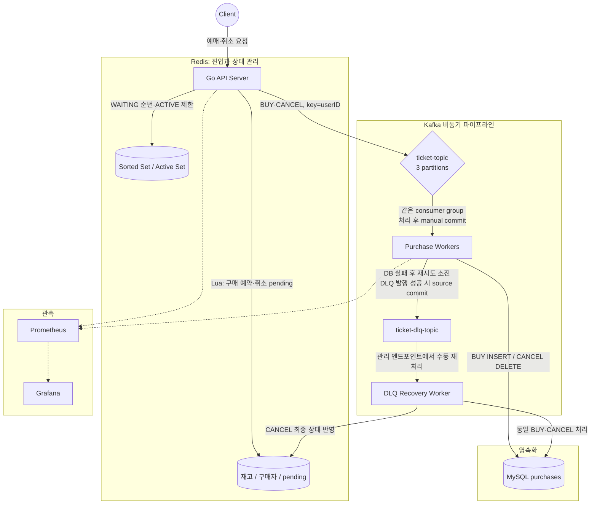
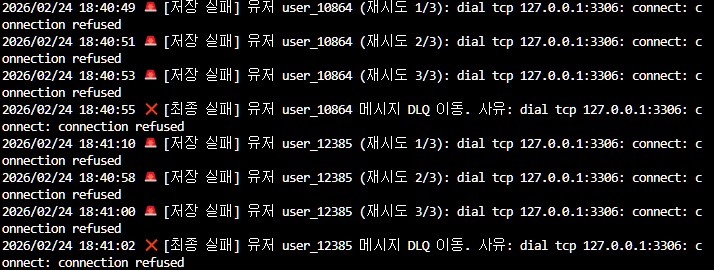
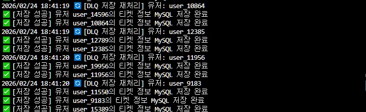
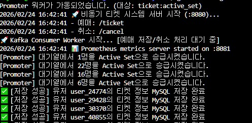
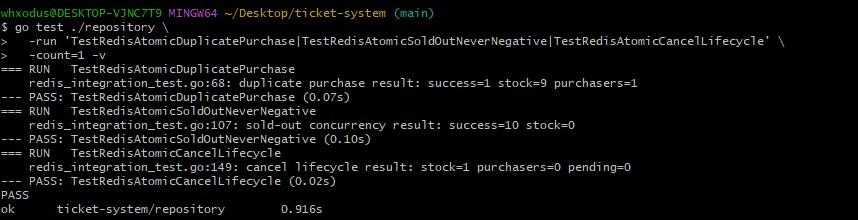
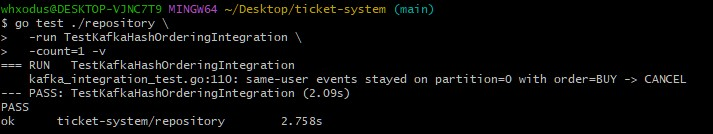
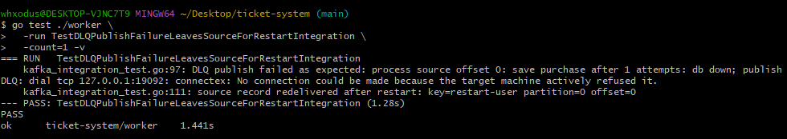
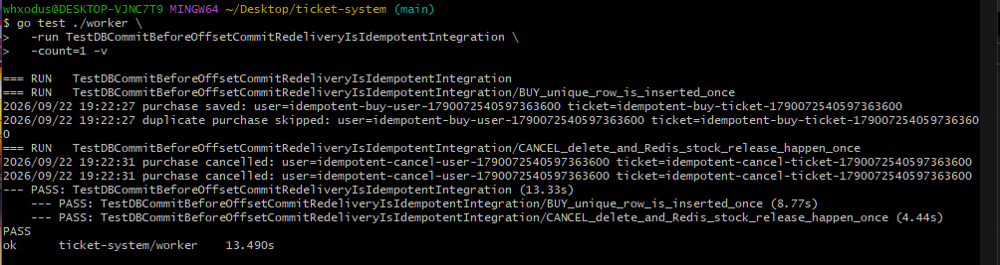
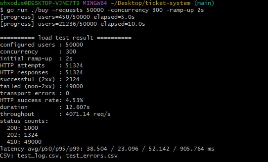
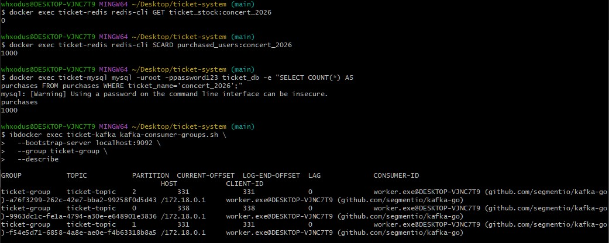

# 🎫 티켓 예매 동시성 제어 프로젝트 (Ticket-System)

동시 예매에서 시작해 중복 구매, 동기식 DB 쓰기 병목, 비동기 처리의 장애 경계를 차례로 다룬 Go 백엔드 프로젝트입니다. 각 버전은 앞 단계에서 확인한 문제를 해결하기 위해 만들어졌습니다. 현재 구현과 과거 태그의 기능은 구분해서 설명합니다.

## 전체 아키텍처

API는 Redis에서 진입·재고 상태를 처리하고 Kafka에 이벤트를 발행합니다. 별도 워커 프로세스의 3개 consumer가 **같은** `ticket-group`에서 MySQL을 갱신합니다. DB 처리가 실패하면 DLQ로 격리하고, `/admin/recover-dlq`로 수동 재처리를 시작할 수 있습니다. 이 엔드포인트의 응답은 재처리 **시작**을 뜻하며 복구 완료를 뜻하지 않습니다.

## 📌 버전별 개발 기록

### 🔴 v1.0: 인프라 구축과 기본 예매 흐름

Docker로 Redis·MySQL을 띄우고 Go API에서 구매 요청을 받아 재고를 확인·차감하는 기본 흐름을 만들었습니다. 초기 동시성 제어에는 Redis `SETNX` 락을 사용했습니다. 기능은 연결됐지만, 동시 요청이 몰릴 때 DB 연결과 재고 처리의 동작을 더 확인해야 했습니다.

### 🟡 v2.0: 동시 요청과 DB 연결 폭주 대응

동시 예매에서 재고보다 많은 판매가 일어나지 않도록 Redis 락으로 재고 차감 구간을 보호하고, MySQL 연결 풀(`MaxOpenConns=100`, `MaxIdleConns=50`)을 설정했습니다. 구매 내역 저장도 추가했습니다. 이 단계의 목표는 **초과 판매를 막는 것**이었지만, 서로 다른 요청이 같은 사용자에게서 오면 1인 1매 정책까지 만족하는지는 별도 문제였습니다. 과거 README의 “동시에 1,000명 접속”은 당시 로컬 부하 시나리오의 설정값이지 운영 환경 보장은 아닙니다.

### 🟢 v3.0: 동일 사용자 중복 구매 방어

재고가 남아 있어도 같은 사용자가 여러 번 요청하면 구매 행이 중복될 수 있었습니다. 락 획득 전·후에 구매 이력을 다시 확인해, 확인과 저장 사이에 다른 요청이 끼어드는 경우를 줄였습니다. 동시에 구매 이력 조회와 저장이 MySQL에 의존해 동기식 처리의 비용이 커지는 지점도 드러났습니다.

### 🔵 v4.0: 취소 흐름과 동기식 쓰기의 한계

구매 내역 삭제 후 Redis 재고와 구매자 상태를 되돌리는 취소 흐름을 추가했습니다. Redis 재고 차감과 MySQL 구매 저장이 요청 경로에 함께 남아 있어, 쓰기 지연은 그대로 API 응답 지연으로 이어졌습니다. 과거 테스트에서 MySQL `INSERT`의 Slow SQL을 관찰했고, API 요청과 DB 쓰기를 분리할 필요가 생겼습니다. 이 단계의 순차적 취소는 DB와 Redis를 하나의 트랜잭션으로 묶은 것은 아니었습니다.

### 🟣 v4.5: Kafka로 API와 MySQL 쓰기 분리

API가 구매 이벤트를 Kafka에 발행하고 별도 워커가 MySQL에 저장하는 비동기 쓰기 구조로 바꿨습니다. 요청 경로에서 MySQL `INSERT`를 기다리지 않게 됐지만, API의 성공 응답은 이 시점에 **Kafka 발행·Redis 예약 성공**을 뜻하며 MySQL 영속화 완료를 뜻하지 않습니다.

중복 이벤트에 대비해 `purchases(user_id, ticket_name)` UNIQUE 제약과 GORM `clause.OnConflict{DoNothing: true}`를 사용했습니다. 같은 구매를 다시 저장하려 하면 UNIQUE 충돌에 따른 INSERT가 no-op이 됩니다. 다만 당시의 소비·오프셋 처리만으로 장애 후 재전달의 모든 경계가 검증된 것은 아니었습니다.

### 🟤 v5.0: 재고 보호 Lua와 비동기 취소

단순 `DECR`만 사용하면 매진 직후 경쟁 요청으로 재고가 음수가 될 수 있어, 재고 확인과 차감을 Redis Lua 스크립트로 묶었습니다. 취소도 Kafka 이벤트를 통해 DB 삭제를 비동기로 처리하도록 바꿨습니다. 그러나 당시에는 Redis의 구매자·취소 상태와 Kafka 발행의 관계, DB 장애 시 메시지 처리 경계를 충분히 다루지 못했습니다.

과거 README는 DLQ까지 v5.0에 묶어 설명했지만 **실제 v5.0 태그에는 DLQ가 없고**, 아래 재시도·DLQ 처리는 v6.0 코드에서 확인됩니다.

### ⚪ v6.0: 실패 메시지 격리와 관측

MySQL 작업이 실패하면 제한된 횟수로 재시도한 뒤 `ticket-dlq-topic`으로 보내는 흐름을 추가했습니다. DB를 중단해 실패 메시지가 DLQ에 들어가는 모습과, DB 복구 뒤 관리 경로로 재처리되는 모습을 캡처했습니다. DLQ 저장만으로 복구가 끝나는 것은 아닙니다.

Prometheus 메트릭과 Grafana 대시보드를 더해 요청·저장 흐름을 관찰했습니다. 아래 화면은 당시 로컬 실행의 추이를 보여줍니다. 그래프만으로 모든 메시지의 영속화나 장애 복구 완료를 증명하지는 않습니다.

### ⚫ v7.x: Virtual Waiting Queue로 진입 부하 조절

동시 요청을 무제한으로 예매 구간에 넣는 대신 Redis Sorted Set에 WAITING 사용자를 두고 순번을 반환하며, ACTIVE 사용자 수를 제한하는 진입 제어를 추가했습니다. promoter가 대기 사용자를 ACTIVE로 옮긴 뒤 예매를 진행합니다. WAITING 응답은 구매 확정이 아닙니다.

이 기능은 **v7.0 태그 자체가 아니라 태그 직후 `c08dce4` 커밋**에서 추가됐습니다. 이전 README의 “v7.0에서 최종 완성”이라는 표현은 태그 이력과도, 남은 장애 경계와도 맞지 않아 여기서는 후속 고도화로 구분합니다.

### 🔶 v8.0: Kafka 장애 경계 재검증과 예매 상태 전이 보강

기존 흐름은 DB 실패 → 재시도 → DLQ 격리 → 수동 재처리까지 갖췄습니다. 하지만 “MySQL commit 뒤 offset commit 전에 워커가 종료되면?”, “DLQ 발행도 실패하면?”, “BUY와 CANCEL이 다른 파티션에 들어가면?”, “재시도와 replay가 복구 중인 시스템에 부하를 더하지는 않나?”라는 질문이 남았습니다.

이 질문을 별도 [kafka-recovery-lab](https://github.com/whxodus0121/kafka-recovery-lab)에서 at-least-once delivery, manual commit, 중복 전달과 멱등 소비, Retry/DLQ/Replay, Backoff/Jitter, Retry Storm, 복구 속도 제어 실험으로 분리해 다뤘습니다. 이후 결과를 전부 복사하지 않고 현재 예매 도메인에 필요한 Redis 상태 전이, 사용자 단위 순서, offset/DLQ 경계와 중복 처리 방어만 v8에 적용했습니다. Lab의 retry topic·전용 recovery rate limiter·`processed_events` 테이블은 이 저장소에 없습니다.

#### Redis 예약과 취소의 상태 전이

동일 사용자의 동시 요청에서 중복 확인과 재고 차감 사이에 다른 요청이 끼어들 수 있었습니다. 현재 구매 예약은 하나의 Lua 실행 안에서 `SISMEMBER → 재고 확인 → DECR → SADD`를 처리합니다. Kafka 구매 이벤트 발행 실패 시 rollback도 구매자 제거가 실제로 일어난 경우에만 재고를 복구합니다.

취소는 `BeginCancel → Kafka CANCEL 발행 → worker의 DB 삭제 → FinalizeCancel` 순서입니다. 발행 전에는 pending만 표시하고 재고를 돌려주지 않습니다. `FinalizeCancel`은 pending을 제거한 첫 실행에서만 구매자 제거와 재고 증가를 수행하므로 재전달에 따른 이중 복구를 피합니다. Redis 통합 테스트에서 중복 구매는 성공 1건·재고 9·구매자 1명, 재고 10장 경쟁은 성공 10건·재고 0, 취소 후 재고 1·구매자 0·pending 0을 확인했습니다.

#### 같은 사용자 이벤트의 Kafka 순서

BUY와 CANCEL의 key를 모두 `userID`로 설정하고 `kafka.Hash`로 파티션을 고릅니다. 같은 사용자 key의 이벤트는 같은 파티션에 들어가 순서대로 소비될 수 있습니다. 통합 테스트에서 동일 사용자 BUY → CANCEL이 파티션 0에 순서대로 기록됐습니다. 이는 **사용자 단위 순서**이며, 토픽 전체의 글로벌 순서나 DLQ replay와 새 source 이벤트 사이의 순서를 보장하지 않습니다.

#### MySQL·DLQ와 source offset의 경계

워커는 `FetchMessage → BUY/CANCEL 처리 → CommitMessages`를 사용합니다. MySQL 처리가 성공하면 source offset을 commit합니다. 재시도 후에도 DB 처리가 실패하면 **DLQ 발행이 성공한 뒤에만** source offset을 commit합니다. DB 처리와 DLQ 발행이 모두 실패하면 commit하지 않고 워커를 멈춰, 다음 소비가 실패한 파티션의 뒤쪽 offset을 먼저 진행시키지 않게 합니다.

특히 DB 장애와 도달 불가능한 DLQ 주소 `127.0.0.1:19092`를 동시에 주입한 통합 테스트에서 DLQ 발행 실패를 확인했습니다. 이후 consumer를 재시작했을 때 동일 source record(`restart-user`, partition 0, offset 0)가 다시 전달됐습니다. “DB 실패면 DLQ로 간다”에서 한 단계 더 나아가 **DLQ 자체가 실패할 때 원본을 남기는 경계**를 검증한 것입니다. DLQ 발행 성공 후 source commit이 실패하면 DLQ 중복 가능성은 여전히 남습니다.

#### DB commit 후 offset commit 실패와 멱등성

Kafka offset commit과 외부 MySQL commit은 하나의 트랜잭션이 아닙니다. `MySQL commit 성공 → offset commit 실패/워커 종료 → 같은 record 재전달`은 제거할 수 없으므로 at-least-once 전달을 허용하고 현재 부수효과를 멱등하게 처리합니다. BUY는 UNIQUE 제약과 `OnConflict{DoNothing: true}`로 중복 INSERT를 건너뜁니다. CANCEL은 같은 행을 다시 DELETE해도 최종 행이 0이고, Redis `FinalizeCancel`도 pending이 없다면 재고를 다시 늘리지 않습니다.

실제 Kafka·MySQL 통합 테스트에서 DB 반영 직후 offset commit 실패를 주입했습니다. 재전달된 BUY 로그는 `purchase saved` 다음 `duplicate purchase skipped`로 이어졌고, CANCEL도 DELETE와 Redis 재고 반환이 한 번만 남았습니다. 이는 현재 BUY/CANCEL 부수효과에 대한 검증이지 exactly-once 보장은 아닙니다.

Lab에서는 `eventId`와 `processed_events`를 같은 DB 트랜잭션에 기록하는 방식도 실험했습니다. 현재 도메인은 UNIQUE INSERT, 반복 DELETE, pending 조건부 Redis no-op으로 동일 record 재전달을 방어할 수 있어 별도 테이블의 트랜잭션·인덱스·저장 비용을 선택하지 않았습니다. 결제, 포인트, 감사 로그, 누적 UPDATE처럼 비멱등 효과가 생기면 이벤트 식별자 저장을 다시 검토해야 합니다.

#### 최신 로컬 부하 재측정과 사후 확인

초기 재고 1,000장에서 **50,000 user journeys를 동시성 300, 초기 ramp-up 2초**로 실행했습니다. WAITING 사용자의 재조회까지 합쳐 총 51,324번의 HTTP 요청·응답이 발생했고 전송 오류는 0건이었습니다. 한 번의 로컬 실행에서 12.607초, 4,071.14 req/s를 기록했습니다. 평균 38.504ms, p50 23.096ms, p95 52.142ms, p99 905.764ms입니다. 운영 환경의 지속 처리율로 일반화할 수 없습니다.

| HTTP 상태 | 건수 | 해석 |
|---|---:|---|
| 200 | 1,000 | 구매 요청 성공 |
| 202 | 1,324 | 대기열 응답·재조회, 구매 성공 아님 |
| 410 | 49,000 | 초기 재고 1,000장 소진 뒤 의도된 Sold Out |

2xx 2,324건을 구매 성공으로 세지 않았고, 410을 시스템 장애로 분류하지 않았습니다.

실행 후 Redis 재고 0, Redis 구매자 1,000명, MySQL `concert_2026` 구매 행 1,000개를 직접 확인했습니다. Kafka `ticket-group`의 세 파티션은 모두 LAG 0이었고, CURRENT-OFFSET 합계도 1,000으로 HTTP 200 구매 성공 건수와 일치했습니다. 이는 **해당 로컬 실행의 관측값**입니다.

#### 남은 한계

- Redis 예약 성공 직후 Kafka 발행 전에 API 프로세스가 죽으면 두 시스템은 원자적으로 함께 갱신되지 않습니다. 이를 메우려면 outbox나 reconciliation 같은 별도 설계가 필요합니다.
- 오래된 BUY가 DLQ에 남은 동안 뒤의 CANCEL 등 상태가 진행되면, 나중의 replay는 최신 상태와 순서 충돌을 일으킬 수 있습니다. 현재 수동 replay가 이를 일반적으로 해결하지는 않습니다.
- 개발용 Kafka는 single broker·replication factor 1입니다. 브로커 자체 장애에 대한 내구성을 검증한 구성이 아닙니다.
- 멱등성 검증 범위는 현재 BUY/CANCEL 부수효과입니다. 이번 로컬 실행의 p99 905.764ms tail latency 원인도 아직 확정하지 못했습니다.

## 🛠 Tech Stack

- **Language:** Go
- **Database:** MySQL 8.0, GORM, `(user_id, ticket_name)` UNIQUE 제약
- **Cache & Queue:** Redis, Lua, Sorted Set / Active Set
- **Message Broker:** Apache Kafka (`ticket-topic`, `ticket-dlq-topic`)
- **Monitoring:** Prometheus, Grafana
- **Local infrastructure:** Docker Compose

## 🚦 실행 방법

1. `docker compose up -d`로 MySQL·Redis·Kafka·Prometheus·Grafana를 실행합니다. `mysql-init.sql`이 초기 DB에서 `purchases`와 `tickets` 테이블 및 UNIQUE 제약을 생성합니다.
2. 별도 터미널에서 `go run ./cmd/worker`로 source consumer 워커를 실행합니다.
3. `go run .`으로 API(`:8080`)를 실행합니다. 재고 `ticket_stock:concert_2026`은 키가 없을 때만 1,000으로 초기화되므로 재실행만으로 테스트 상태가 초기화되지 않습니다.
4. `GET /ticket?user_id=...`로 예매하고 `GET /cancel?user_id=...`로 취소 요청을 보냅니다. 장애 복구 실험에서는 DB 정상화 후 `/admin/recover-dlq`로 수동 재처리를 시작할 수 있습니다.
5. 로컬 부하 클라이언트는 `go run ./buy -requests 50000 -concurrency 300 -ramp-up 2s`로 실행합니다. 재현 전에는 Redis·MySQL·Kafka의 기존 상태를 별도로 확인해야 합니다.

통합 테스트는 실제 Redis·Kafka·MySQL을 사용하는 항목이 있으므로, 실행 전 해당 서비스와 테스트별 환경변수 조건을 확인해야 합니다. 캡처된 PASS는 기록된 로컬 실행의 결과이며 모든 환경에서의 재현을 뜻하지 않습니다.
